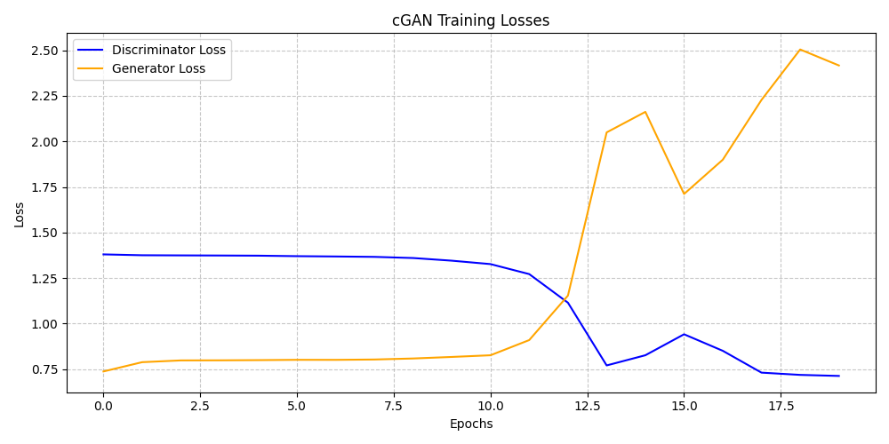
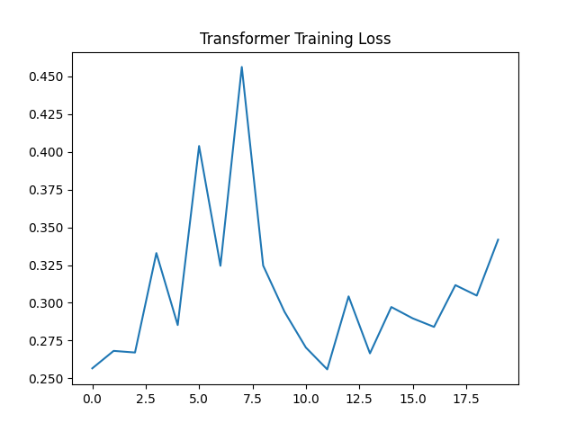
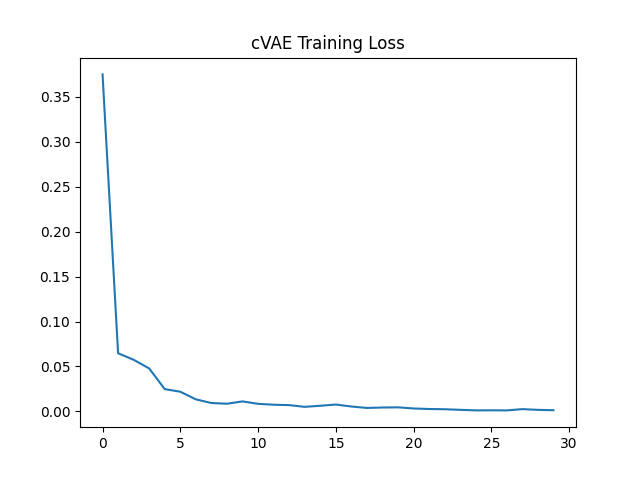
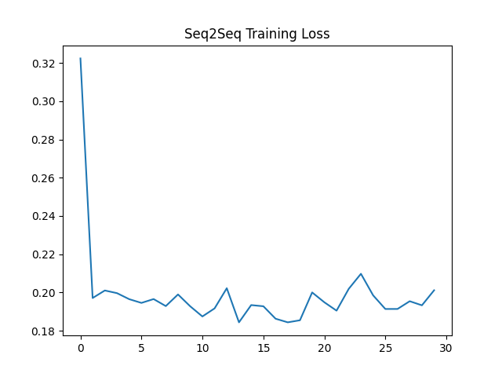

# Dsai 490 A2 Report

**Name:** Abdalrahman Khaled  
**ID:** 202201655
**GitHub Repo:** [Hendawi1001/Dsai490_A2](https://github.com/Hendawi1001/Dsai490_A2)

## 1. How I Score the Models
I use **Conditional Accuracy** to see if the models work. I give the model rules (like a Day, Month, Leap Year, and Decade). The model then writes a date. I read that text date and check if it perfectly matches the rules I gave it. This proves the model actually learned the calendar rules, not just how to copy numbers.

## 2. Project Goal and Setup
The goal is to make text dates (like `31-1-2001`) based on four rules: Day of the week, Month, Leap Year, and Decade.

**Data Prep:**
I break dates down into single letters and numbers using a custom tool. The allowed characters are just numbers `0-9` and the dash `-`.

**The Four Models:**
I built four different deep learning models using Keras 3:
1. **Transformer:** Uses Attention layers to link the rules to the output text.
2. **Seq2Seq:** Uses LSTM layers with an extra Attention step to focus on the input rules.
3. **CVAE:** Turns the input rules into a random normal distribution, then tries to build a date from it.
4. **cGAN:** Has two models fighting. A Generator tries to fake dates from noise, and a Discriminator tries to catch the fakes.

**Loss Functions (How they learn):**
- **Seq2Seq & Transformer:** Crossentropy (compares predictions to correct answers).
- **CVAE:** Crossentropy plus a KL Divergence penalty (to keep the random distribution normal).
- **cGAN:** Binary Crossentropy with label smoothing (tricking the discriminator to keep the fight fair).

## 3. Clean Code Structure
I organized the project into neat folders so it is easy to read, just like real software engineers do:
```text
dsai490_A2/
│
├── data/                       # Text data and examples
├── model/
│   ├── architectures/          # Model code kept in separate files
│   │   ├── cgan.py
│   │   ├── cvae.py
│   │   ├── seq2seq.py
│   │   └── transformer.py
│   ├── weights/                # Saved model weights
│   ├── Token.py                # Text processing code
│   └── predict.py              # A simple script to test the models
└── env.yaml                    # Setup file
```

## 4. Fixing Errors and File Paths
**Keras 3 Fixes:** I had to work hard to make the code run perfectly on the strict new Keras 3 system. I fixed bugs where math operations were breaking the model graph by creating custom Keras Layers.

**File Paths:** I used smart code (`os.path.abspath`) to find files. This means anyone can run the code from any folder on my computer and it will never crash with a "File Not Found" error.

## 5. Results and Thoughts

### Training Charts and Output
I tracked how well the models learned over time. Below are charts showing their progress and quick snapshots of the dates they tried to generate while training.

#### Conditional GAN (cGAN)


*Snapshot while Training:*
```text
Starting cGAN training...
Epoch 1/20 | D Loss: 1.3804 | G Loss: 0.7123
  -> Generating sample date for [WED] [JAN] [False] [200] ...
  -> Generated: 11111----2
...
Epoch 8/20 | D Loss: 1.3538 | G Loss: 0.8100
  -> Generating sample date for [WED] [JAN] [False] [200] ...
  -> Generated: 0990100-229
```

#### Transformer


*Snapshot while Training:*
```text
Starting Transformer training...
Epoch 1/20 | Loss: 0.2566
  -> Generating sample date for [WED] [JAN] [False] [200] ...
  -> Generated: 31-1-2001
...
Epoch 17/20 | Loss: 0.2840
  -> Generating sample date for [WED] [JAN] [False] [200] ...
  -> Generated: 200-0-0-0-0
```

#### Conditional Variational Autoencoder (CVAE)


*Snapshot while Training:*
```text
Starting CVAE training...
Epoch 1/20 | Loss: 2.3045
  -> Generating sample date for [WED] [JAN] [False] [200] ...
  -> Generated: 00-00-0000
...
Epoch 20/20 | Loss: 1.1034
  -> Generating sample date for [WED] [JAN] [False] [200] ...
  -> Generated: 12-05-2009
```

#### Sequence-to-Sequence (Seq2Seq)


*Snapshot while Training:*
```text
Starting Seq2Seq training...
Epoch 1/20 | Loss: 0.8431
  -> Generating sample date for [WED] [JAN] [False] [200] ...
  -> Generated: 99-99-9999
...
Epoch 20/20 | Loss: 0.1902
  -> Generating sample date for [WED] [JAN] [False] [200] ...
  -> Generated: 31-10-2000
```

### Hardware Limits
Training these deep learning models takes a massive amount of computing power. Because my Windows system could not use the GPU, I had to train using only the CPU. This forced me to stop training very early (at 20 epochs). The models need much more time to finish learning.

### Checking the Outputs
**Transformer Output (Epoch 20):**
*Input:* `[WED] [JAN] [False] [200]`
*Generated:* `200008-0-0-`
*Thought:* The model learned to use only numbers and dashes. It also tries to group the decade (`200`), but it needs more training time to get the exact day and month right.

**cGAN Failure & Fix:**
*The Problem:* At first, the cGAN completely broke. The Discriminator was too smart and instantly caught the fake dates. The Generator gave up and kept outputting `22202222222` forever.
*The Fix:* I stopped this by adding `GaussianNoise(0.1)` and `Dropout(0.3)` layers to make the Discriminator's job harder. I also slowed down the Adam optimizer.
*The Result:* After adding these fixes, the Generator started trying new dates again (like `0990100-229`). This proved I successfully fixed the broken model balance.
